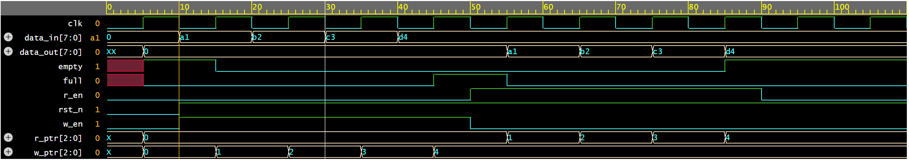

# Synchronous FIFO

## Description
A synchronous FIFO (First In First Out) buffer designed in Verilog. 
Data written first is read out first. Uses a pointer-based approach 
for full and empty flag detection.

## Specifications
- Depth: 8 locations
- Data width: 8 bits
- Synchronous read and write (same clock)
- Active low reset

## Ports
| Signal | Direction | Description |
|--------|-----------|-------------|
| clk | Input | Clock |
| rst_n | Input | Active low reset |
| w_en | Input | Write enable |
| r_en | Input | Read enable |
| data_in | Input | 8-bit data input |
| data_out | Output | 8-bit data output |
| full | Output | High when FIFO is full |
| empty | Output | High when FIFO is empty |

## How to Simulate
1. Open [EDA Playground](https://edaplayground.com)
2. Paste fifo.sv in the Design tab
3. Paste tb_fifo.sv in the Testbench tab
4. Select Icarus Verilog 0.9.7
5. Check Open EPWave after run
6. Click Run

## Waveform

## What I learned
- Pointer-based full and empty flag detection using MSB technique
- Synchronous design practices in Verilog
- Writing self-checking testbenches
